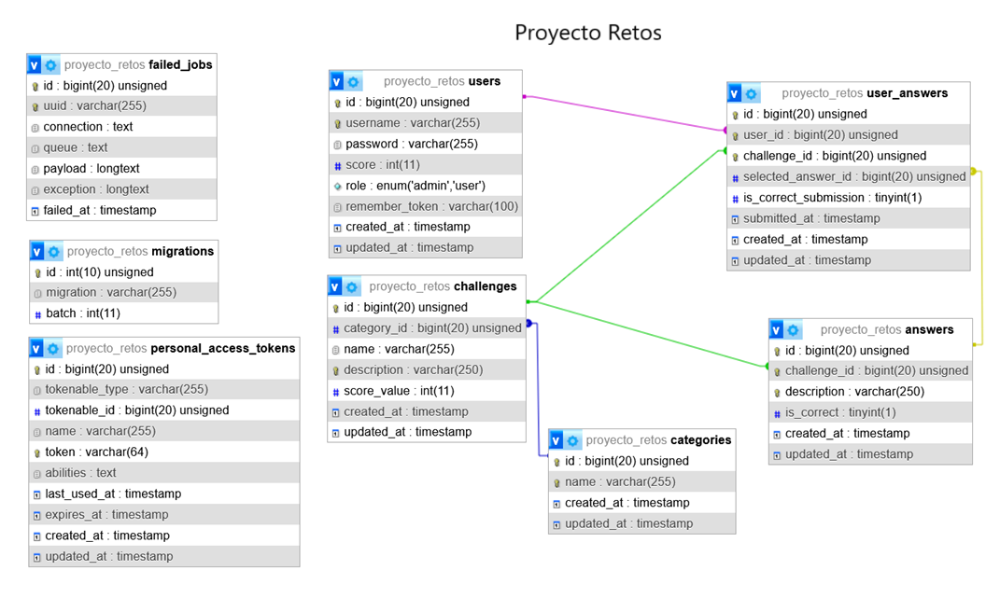

# Plataforma de Retos - Backend
Aplicación backend en Laravel para gestionar retos con categorías, respuestas y puntuaciones de usuarios. Permite registro/login (JWT), creación y administración de categorías y retos (admins), envío de respuestas por usuarios y genera automáticamente un nuevo reto en base a una categoría por medio de OpenAI.

## 🌍 Enlace del proyecto
🔗 https://proyectoretos-production.up.railway.app/api

## Requisitos
- PHP >= 8.0
- Composer
- MySQL / MariaDB (o DB soportada por Laravel)
- Extensiones PHP comunes

## Variables de entorno
-DB_CONNECTION=mysql
-DB_HOST=localhost
-DB_PORT=3307
-DB_DATABASE=proyecto_retos
-DB_USERNAME=root
-DB_PASSWORD=
-JWT_SECRET=tu_JWT_SECRET
-OPENAI_API_KEY=tu_OPENAI_API_KEY
-OPENAI_MODEL=gpt-4o-mini

## Configuración local
1. Clonar repo
git clone <repositorio> proyectoRetos

2. Instalar dependencias PHP
composer install

3. Copiar .env y configurar
cp .env.example .env
editar `.env` con tus credenciales DB y JWT_SECRET
   
4. Generar App Key y JWT secret
php artisan key:generate
php artisan jwt:secret

5. Migrar y seed
php artisan migrate
php artisan db:seed

6. Levantar servidor local
php artisan serve --host=127.0.0.1 --port=8000

## Endpoints principales

### Rutas públicas:
- Registrar un nuevo usuario
  curl -X POST http://127.0.0.1:8000/api/register \
  -H "Content-Type: application/json" \
  -d '{"username":"usuario1","password":"password123"}'

- Login (obtén token)
  curl -X POST http://127.0.0.1:8000/api/login \
  -H "Content-Type: application/json" \
  -d '{"username":"admin","password":"admin123"}'

### Rutas que requieren autenticación:
### Usuarios
- Perfil del usuario autenticado (admin/user)
  curl -H "Authorization: Bearer <USER_OR_ADMIN_TOKEN>" \
  -H "Accept: application/json" \
  GET http://127.0.0.1:8000/api/users/me

- Listar todos los usuarios (admin)
  curl -H "Authorization: Bearer <ADMIN_TOKEN>" \
  -H "Accept: application/json" \
  GET http://127.0.0.1:8000/api/users

- Ver un usuario por id (admin)
  curl -H "Authorization: Bearer <ADMIN_TOKEN>" \
  -H "Accept: application/json" \
  GET http://127.0.0.1:8000/api/users/2

- Logout (admin)
  curl -X POST http://127.0.0.1:8000/api/user/logout \
  -H "Authorization: Bearer <ADMIN_TOKEN>" \
  -H "Accept: application/json"

### Categorias
- Listar categorías (admin/user)
  curl -H "Authorization: Bearer <USER_OR_ADMIN_TOKEN>" \
  -H "Accept: application/json" \
  GET http://127.0.0.1:8000/api/categories

- Ver categoría por id (admin/user)
  curl -H "Authorization: Bearer <USER_OR_ADMIN_TOKEN>" \
  -H "Accept: application/json" \
  GET http://127.0.0.1:8000/api/categories/1

- Crear categoría (admin)
  curl -X POST http://127.0.0.1:8000/api/categories \
  -H "Authorization: Bearer <ADMIN_TOKEN>" \
  -H "Content-Type: application/json" \
  -d '{"name":"Programación"}'

- Actualizar categoría (admin)
  curl -X PUT http://127.0.0.1:8000/api/categories/1 \
  -H "Authorization: Bearer <ADMIN_TOKEN>" \
  -H "Content-Type: application/json" \
  -d '{"name":"Programación avanzada"}'

- Eliminar categoría (admin)
  curl -X DELETE http://127.0.0.1:8000/api/categories/1 \
  -H "Authorization: Bearer <ADMIN_TOKEN>" \
  -H "Accept: application/json"

### Retos
- Listar retos (opcional, filtrar por categoría: ?category_id=1) (admin/user)
  curl -H "Authorization: Bearer <USER_OR_ADMIN_TOKEN>" \
  -H "Accept: application/json" \
  GET http://127.0.0.1:8000/api/challenges?category_id=1
  GET http://127.0.0.1:8000/api/challenges

- Ver reto por su id con sus respuestas (admin muestra la correcta, user no)
  curl -H "Authorization: Bearer <USER_OR_ADMIN_TOKEN>" \
  -H "Accept: application/json" \
  GET http://127.0.0.1:8000/api/challenges/11

- Crear reto con respuestas (admin)
  curl -X POST http://127.0.0.1:8000/api/challenges \
  -H "Authorization: Bearer <ADMIN_TOKEN>" \
  -H "Content-Type: application/json" \
  -d '{
    "category_id":1,
    "name":"Reto ejemplo",
    "description":"Resuelve X",
    "score_value":10,
    "answers":[
      {"description":"A","is_correct":false},
      {"description":"B","is_correct":true},
      {"description":"C","is_correct":false},
      {"description":"D","is_correct":false}
    ]
  }'

- Actualizar reto y sincronizar respuestas (admin)
  curl -X PATCH http://127.0.0.1:8000/api/challenges/11 \
  -H "Authorization: Bearer <ADMIN_TOKEN>" \
  -H "Content-Type: application/json" \
  -d '{
    "name":"Reto modificado",
    "answers":[
      {"id":21,"description":"A mod","is_correct":false},
      {"id":22,"description":"B mod","is_correct":true},
      {"description":"Nueva C","is_correct":false},
      {"description":"Nueva D","is_correct":false}
    ]
  }'

- Eliminar reto (admin)
  curl -X DELETE http://127.0.0.1:8000/api/challenges/11 \
  -H "Authorization: Bearer <ADMIN_TOKEN>" \
  -H "Accept: application/json"

- Enviar respuesta a un reto (submit) (user)
  curl -X POST http://127.0.0.1:8000/api/challenges/11/submit \
  -H "Authorization: Bearer <USER_TOKEN>" \
  -H "Content-Type: application/json" \
  -d '{"selected_answer_id":45}'

### Integracion con OpenAI
- Genera automaticamente un reto en base a una categoria, volver a intentar con otra categria si falla (anmin)
  curl -X POST http://127.0.0.1:8000/api/challenges/generate-random \
  -H "Authorization: Bearer <ADMIN_TOKEN>" \
  -H "Content-Type: application/json" \
  -d '{
    "category_id": 13,
    "answers_count": 4,
    "score_value": 15
  }'

### Respuestas
- Listar todas las answers (autenticado)
  curl -H "Authorization: Bearer <ADMIN_TOKEN>" \
  -H "Accept: application/json" \
  GET http://127.0.0.1:8000/api/answers

- Crear respuesta individual (admin)
  curl -X POST http://127.0.0.1:8000/api/answers \
  -H "Authorization: Bearer <ADMIN_TOKEN>" \
  -H "Content-Type: application/json" \
  -d '{"challenge_id":11,"description":"Opción X","is_correct":false}'

- Actualizar respuesta individual (admin)
  curl -X PATCH http://127.0.0.1:8000/api/answers/45 \
  -H "Authorization: Bearer <ADMIN_TOKEN>" \
  -H "Content-Type: application/json" \
  -d '{"description":"Texto actualizado","is_correct":true}'

- Eliminar respuesta (admin)
  curl -X DELETE http://127.0.0.1:8000/api/answers/45 \
  -H "Authorization: Bearer <ADMIN_TOKEN>" \
  -H "Accept: application/json"

## Licencia
Este proyecto está bajo la licencia MIT.

## Soporte
Si tienes preguntas o necesitas ayuda, no dudes en abrir un Issue en el repositorio o contactarme a través de mi correo electrónico.

## Esquema de la base de datos

## About Laravel

Laravel is a web application framework with expressive, elegant syntax. We believe development must be an enjoyable and creative experience to be truly fulfilling. Laravel takes the pain out of development by easing common tasks used in many web projects, such as:

- [Simple, fast routing engine](https://laravel.com/docs/routing).
- [Powerful dependency injection container](https://laravel.com/docs/container).
- Multiple back-ends for [session](https://laravel.com/docs/session) and [cache](https://laravel.com/docs/cache) storage.
- Expressive, intuitive [database ORM](https://laravel.com/docs/eloquent).
- Database agnostic [schema migrations](https://laravel.com/docs/migrations).
- [Robust background job processing](https://laravel.com/docs/queues).
- [Real-time event broadcasting](https://laravel.com/docs/broadcasting).

Laravel is accessible, powerful, and provides tools required for large, robust applications.

## Learning Laravel

Laravel has the most extensive and thorough [documentation](https://laravel.com/docs) and video tutorial library of all modern web application frameworks, making it a breeze to get started with the framework.

You may also try the [Laravel Bootcamp](https://bootcamp.laravel.com), where you will be guided through building a modern Laravel application from scratch.

If you don't feel like reading, [Laracasts](https://laracasts.com) can help. Laracasts contains over 2000 video tutorials on a range of topics including Laravel, modern PHP, unit testing, and JavaScript. Boost your skills by digging into our comprehensive video library.

## Laravel Sponsors

We would like to extend our thanks to the following sponsors for funding Laravel development. If you are interested in becoming a sponsor, please visit the Laravel [Patreon page](https://patreon.com/taylorotwell).

### Premium Partners

- **[Vehikl](https://vehikl.com/)**
- **[Tighten Co.](https://tighten.co)**
- **[Kirschbaum Development Group](https://kirschbaumdevelopment.com)**
- **[64 Robots](https://64robots.com)**
- **[Cubet Techno Labs](https://cubettech.com)**
- **[Cyber-Duck](https://cyber-duck.co.uk)**
- **[Many](https://www.many.co.uk)**
- **[Webdock, Fast VPS Hosting](https://www.webdock.io/en)**
- **[DevSquad](https://devsquad.com)**
- **[Curotec](https://www.curotec.com/services/technologies/laravel/)**
- **[OP.GG](https://op.gg)**
- **[WebReinvent](https://webreinvent.com/?utm_source=laravel&utm_medium=github&utm_campaign=patreon-sponsors)**
- **[Lendio](https://lendio.com)**

## Contributing

Thank you for considering contributing to the Laravel framework! The contribution guide can be found in the [Laravel documentation](https://laravel.com/docs/contributions).

## Code of Conduct

In order to ensure that the Laravel community is welcoming to all, please review and abide by the [Code of Conduct](https://laravel.com/docs/contributions#code-of-conduct).

## Security Vulnerabilities

If you discover a security vulnerability within Laravel, please send an e-mail to Taylor Otwell via [taylor@laravel.com](mailto:taylor@laravel.com). All security vulnerabilities will be promptly addressed.

## License

The Laravel framework is open-sourced software licensed under the [MIT license](https://opensource.org/licenses/MIT).
